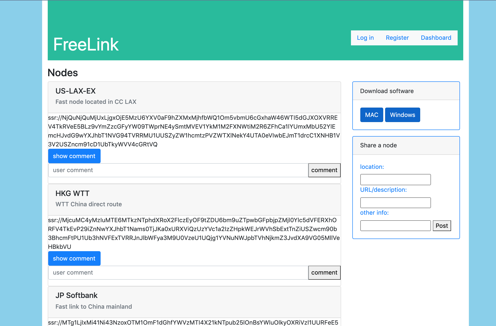
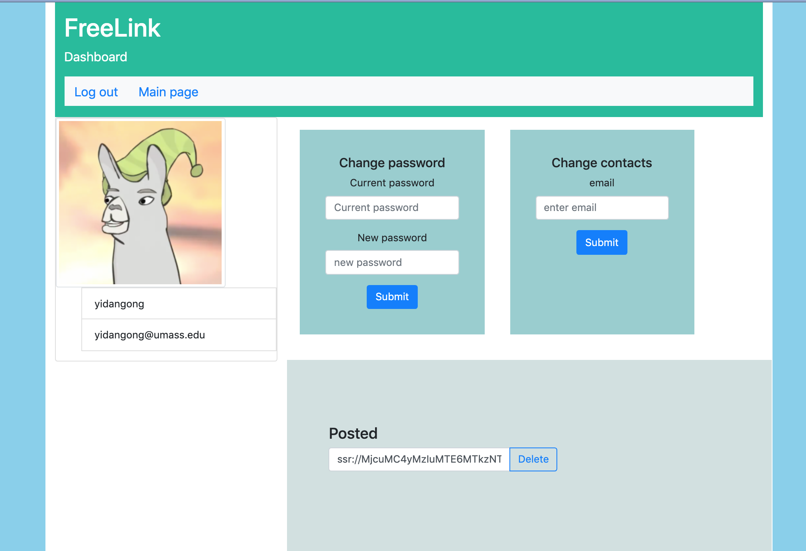
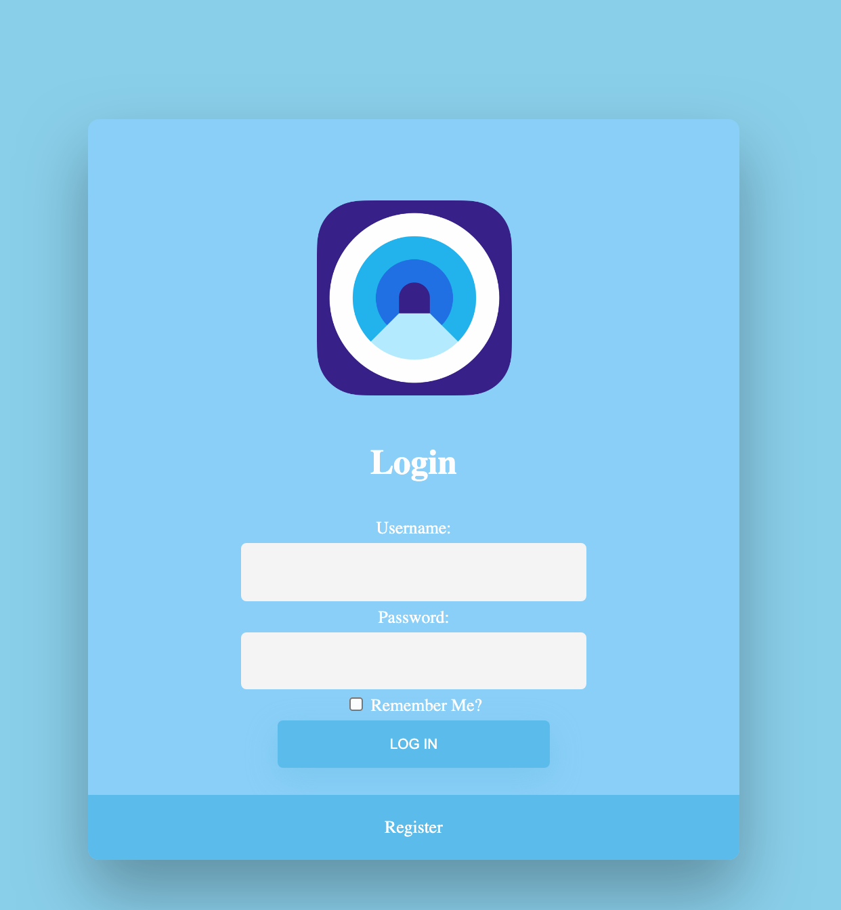

## Team Name: NU

### Freelink Fall 2020

## Application Overview:
Freelink is a website that allows users to share Shadowsocks, V2Ray, and other anonymous proxy server information to help each other. With its collected information, freelink can help people gain access to blocked network services. Freelink is different from other sharing websites in ways where its users are able to interact with each other so together they can provide more up-to-date resources.

## Team Overview:
* Members: yidan gong, sihan cheng, haoyu guan 
* GitHub Usernames:gydddd, Systemrqc, ghyharry

## User Interface:
### Index home page:

### Profile page

### Register page:

### Login page:

### API
*  Create user
*  Update user info (email or password)
*  Get user info 
*  Create node
*  Delete node
*  Get node
*  Create comment 
*  Get comment (for a user or a node)
*  Delete comment

### Database
* node

| Column  | Datatype  | Description  |
|---|---|---|
| node id  | string  | id of the node  |
| info  | json  | information for node such as ip addr,port number and password |
| uid  | string  | id of user who posted the node  |
| name | string  | location of node ip  |
| description | string  | include url and additional info |

* user_table

| column  | Datatype  | Description  |
|---|---|---|
| salt | string  |random string for password protection|
| email | string  | user's email address  |
| name  | string  | user name  |
| password | string  | password of user  |

* comment

| column  | Datatype  | Description  |
|---|---|---|
| comment_id | string  | number id of comment  |
| text  | string  | content of comment  |
| node_id  | string  | id of node that has this comment  |
| uid | string  | id of user who posted this comment  |
| create_date | string  | create date of this comment  |

### URL Routes/Mappings:
* /login
* /register
* /node/all :get all posted nodes.
* /node/:nodeid/comment : get a node’s comment
* /node/comments/create: post a comment
* /nodes/create : post a node
\
private routes:
* /logout
* /user/email or name or nodes or comment : get email/name/nodes/comment for a user
* /user/nodes/NODE_ID: delete a node
* /user/comments/COMMENT_ID : delete a comment
* /user/update/email
* /user/update/pw

### Authentication/Authorization:
Users are authenticated using their name and password they provided at login.
Users need permission to access profile page. All other user interface pages are public.

### Division of Labor
Please refer to previouse milestone documents
https://github.com/nu0990/cs326-final-nu/blob/main/docs/milestone-1.md
https://github.com/nu0990/cs326-final-nu/blob/main/docs/milestone-2.md
https://github.com/nu0990/cs326-final-nu/blob/main/docs/milestone3.md

### Conclusion:
During the design of user interface,we learned a lot about using frontend tools like bootstrap and css.
There are some technical difficulties while implementing frontend javascript and the difficulties was solved by learning more html dom knowledges.
We think it would be better if we had more knowledge about authentication and rendering using javascript.

