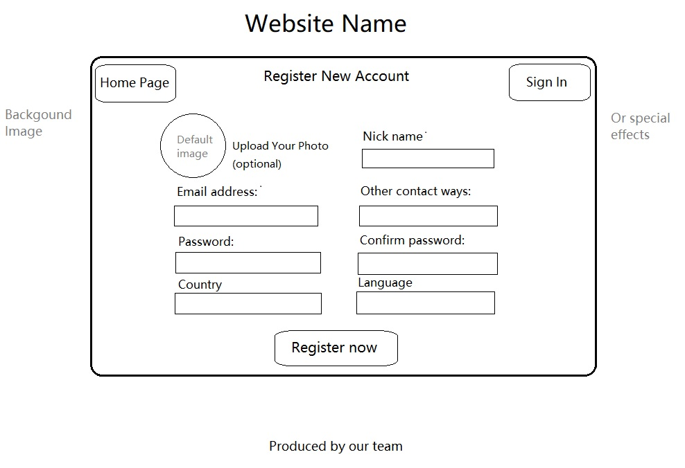
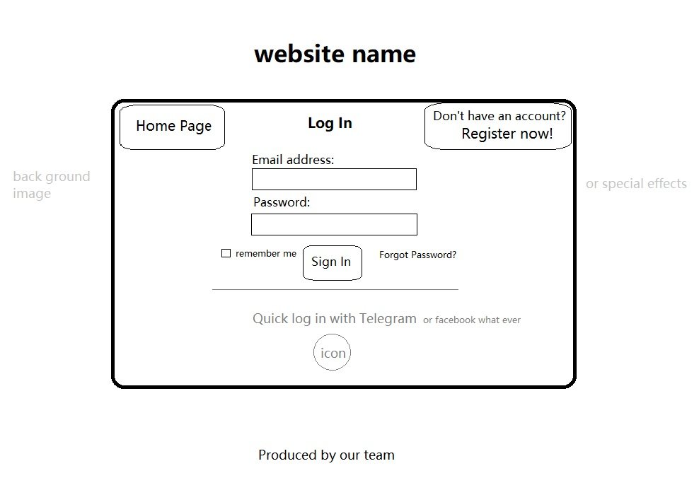

# Data Interaction

# WireFrames
The wireframes can be hand drawn or made using a program. Use these wireframes in tandem with your written explanation above to clearly demonstrate the vision for your application to the course staff. 

This page is used to let users create their account. It will request user input email address, password, other contact information and avatar photo(optional). And will put this information into our database. This interface also includes links back to the homepage or Login page.

This page is used to let users Sign in their account. This will request their email address/nickname and their password to compare with the account information already in the database, and load the corresponding user profile.This interface also includes links back to the homepage or registration interface, It also contains the corresponding actions for remember me and forgot password.

This image is the wireframe of our application's home page.
On top of the main page is the name of our website and a section for users to access their dashboard as well as register or login. Below is a section for displaying node entries uploaded by users. After clicking on an entry, it will show specific information for that node such as user comments and server info. At the bottom of this page, there is a user guide and other relevant information.

This image is the wireframe of our application's user profile page.
This page contains five sections. First section includes basic information of a user. Next, a place for the user to modify the password. A user can also view and edit his favourite nodes, comments, and posts on this page.

# HTML and CSS
