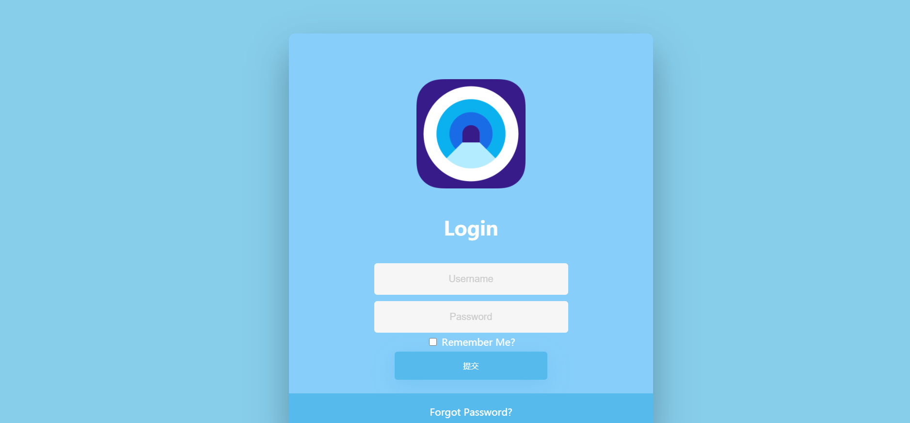
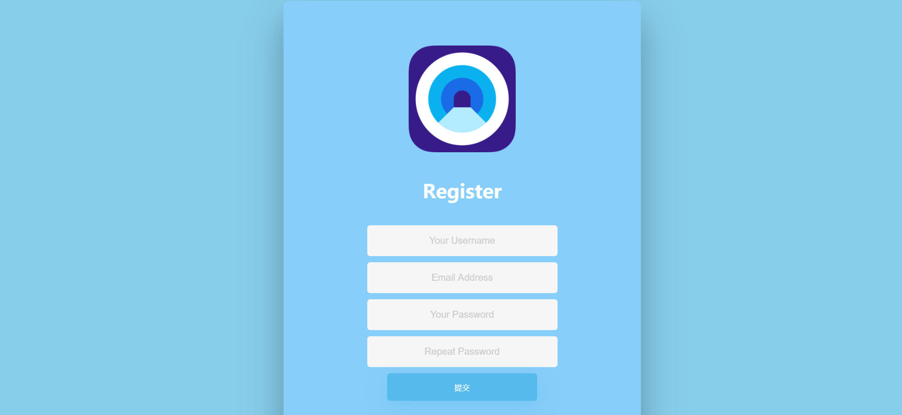
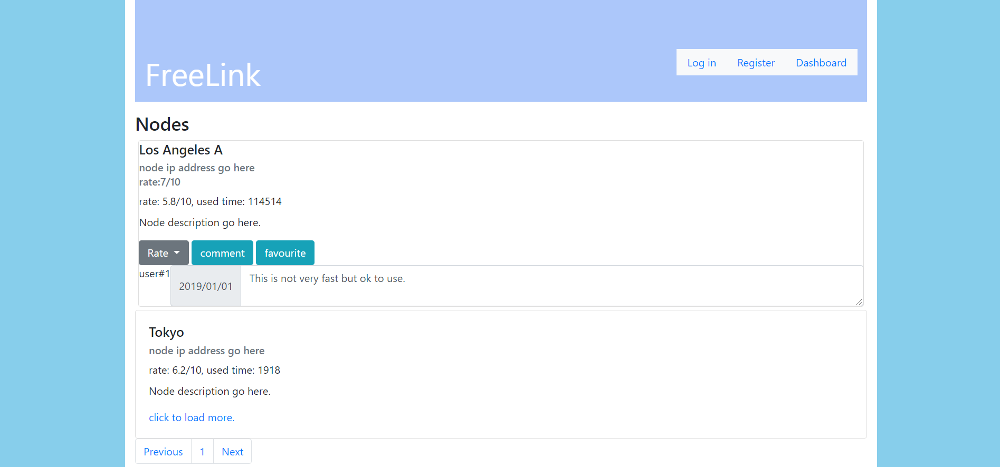
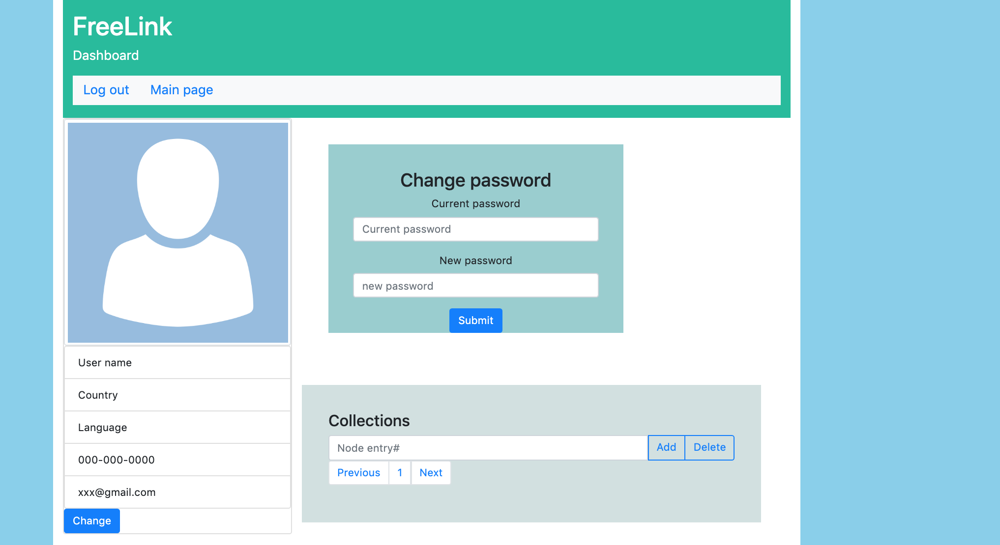
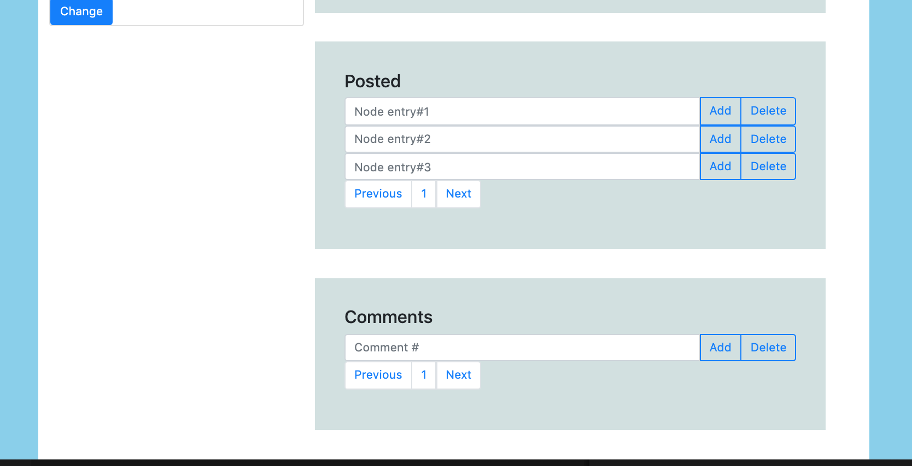

# Data Interaction
Our idea is to create a website that helps people bypass network censorship in some countries, such as China. Our web application allows users to share Shadowsocks, V2Ray, and other anonymous proxy server information to help each other. With everyone's effort in the community, we expect our work can significantly help people gain access to blocked network services. Users can leave comments on the shared information and rate each server link. The users' profiles will include a collection of their uploaded, favorite servers, and comments.Our project takes inspiration from the website lncn.org. However our project will be different in ways where our users are able to interact with each other so together they can provide more up-to-date resources.
Our web application allows users to share Shadowsocks, V2Ray, and other anonymous proxy server information to help each other. Users can leave comments on the shared information and rate each server link.The users' profiles will include a collection of their uploaded, favorite servers, and comments.

Data about each server node:
* Including basic server information, location, server ip address
* And the information obtained from the server, the current delay and the number of users in each time period
* And the information retained by this site, including user reviews, user usage, and user comments 

User's personal information:

* email address, telegram account used to log in quickly, other contact methods
* User’s password and authentication method (if any)
* User uploaded photos and avatars
* Marked server node,  comments, evaluations and scores
Information about this site and our contact information

# WireFrames
The wireframes can be hand drawn or made using a program. Use these wireframes in tandem with your written explanation above to clearly demonstrate the vision for your application to the course staff. 

This page is used to let users create their account. It will request user input email address, password, other contact information and avatar photo(optional). And will put this information into our database. This interface also includes links back to the homepage or Login page.

This page is used to let users Sign in their account. This will request their email address/nickname and their password to compare with the account information already in the database, and load the corresponding user profile.This interface also includes links back to the homepage or registration interface, It also contains the corresponding actions for remember me and forgot password.

This image is the wireframe of our application's home page.
On top of the main page is the name of our website and a section for users to access their dashboard as well as register or login. Below is a section for displaying node entries uploaded by users. After clicking on an entry, it will show specific information for that node such as user comments and server info. At the bottom of this page, there is a user guide and other relevant information.

This image is the wireframe of our application's user profile page.
This page contains five sections. First section includes basic information of a user. Next, a place for the user to modify the password. A user can also view and edit his favourite nodes, comments, and posts on this page.

# HTML and CSS
* Login page

* Register page

* Home page

* Profile page

Division of labor
* Sihan Cheng: Login/Register CSS/html, project management, data construct.
* Yidan Gong: Profile/Homepage CSS/html, Wireframe Homepage and Profile, project management.
* Haoyu Guan: Login, Register, homepage html, Login, Register, homepage CSS prototype; login/register wireframe, project management, discussion arrangement.

