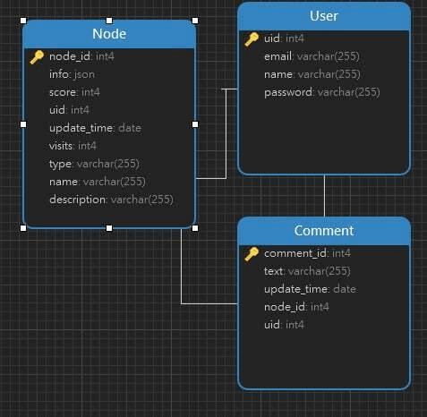

# DataBase document

* node
| Column  | Datatype  | Description  |
|---|---|---|
| node id  | int  | id of the node  |
| info  | json  | information for node |
| score  | int  | rating of node |
| uid  | int  | id of user who posted the node  |
| update time  | date  | update time of node |
| visits  | int  | time visited  |
| type  | json  | type of node  |
| name | string  | location of node ip  |
| description | string  | include url and ip |

* user_table

| column  | Datatype  | Description  |
|---|---|---|
|  uid | int  | a number id of user  |
| email | string  | user's email address  |
| name  | string  | user name  |
| password | string  | password of user  |

* comment

| column  | Datatype  | Description  |
|---|---|---|
| comment_id | int  | number id of comment  |
| text  | string  | content of comment  |
| update time  | date  | posted time of comment  |
| node_id  | int  | id of node that has this comment  |
| uid | int  | id of user who posted this comment  |

# Labor division
* Sihan Cheng：
* Yidan Gong:
* Haoyu Guan:

